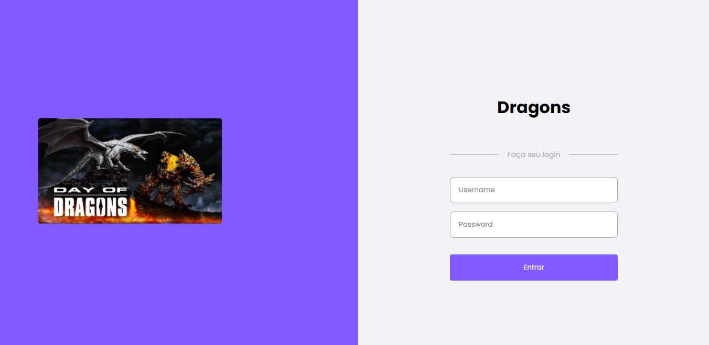
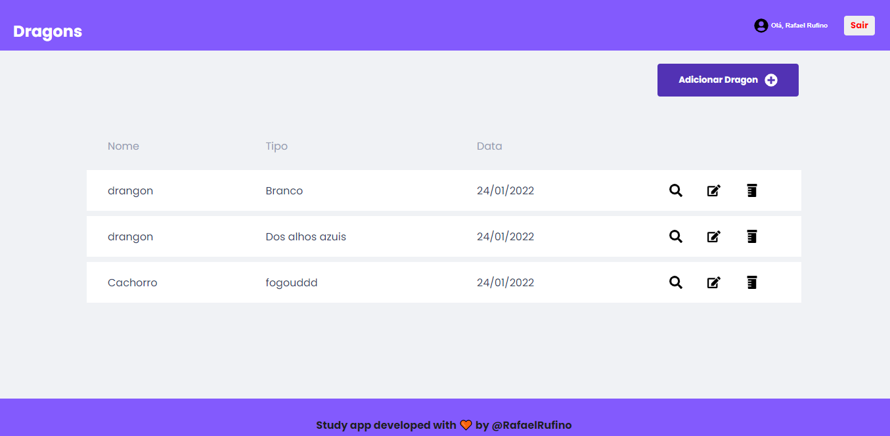
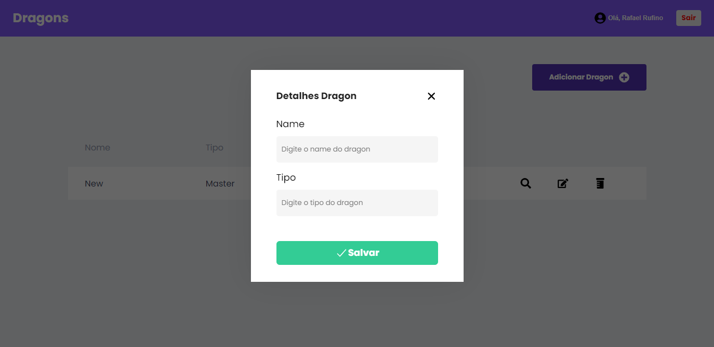

<h1 align="center" style = "color: #835afd;">
    <b style ="color:#835afd;">Dragons🧡</b>
 <br><br>
    <b>Teste para Desenvolvedor(a) Web Sicredi</b>
    <br>

</h1>

<br><br>

## :bookmark: Sobre

O <strong>Dragons</strong> é uma aplicação Web que foi fornecida para um teste tecnico.
<br>

## Conceitos Aplicados

### Context API

### Sass -estilização

### hooks

### Consumo de API

### Criação de Modal

### Typescript

### Salvando login de usuario no localStorage

## :heavy_check_mark: :computer:Resultado WEB

<br><br>
<h1 align="center">
    
</h1>
<h1 align="center">
    
</h1>
<h1 align="center">
    
</h1>


<br/>
<p align="center">
  <a href="#sobre">Projeto</a>&nbsp;&nbsp;&nbsp;|&nbsp;&nbsp;&nbsp;
  <a href="#tecnologias-utilizadas">Tecnologias</a>&nbsp;&nbsp;&nbsp;|&nbsp;&nbsp;&nbsp;
  <a href="#como-usar">Como Usar</a>&nbsp;&nbsp;&nbsp;|&nbsp;&nbsp;&nbsp;
  <a href="#Como-Contribuir">Como Contribuir</a>
 
 
</p>

<p align="center">
 

  
</p>

<br>

<a id="sobre"></a>

<a id="tecnologias-utilizadas"></a>

## :rocket: Tecnologias Utilizadas

O projeto foi desenvolvido utilizando as seguintes tecnologias

- [React](https://pt-br.reactjs.org/)
- [Typescript](https://www.typescriptlang.org/)
- [Sass](https://www.typescriptlang.org/)

<br>

<a id="como-usar"></a>

## Login

```
Username: Rafael
Password: 123456
```

## :fire: Como usar

- ### **Pré-requisitos**

  - É **necessário** possuir o **[Node.js](https://nodejs.org/en/)** instalado na máquina
  - Também, é **preciso** ter um gerenciador de pacotes seja o **[NPM](https://www.npmjs.com/)** ou **[Yarn](https://yarnpkg.com/)**.

1. Faça um clone :

```sh
  Front-End
  git clone https://github.com/Rafael-Rufino/Dragons.git

```

2. Executando a Aplicação:

```sh
  # Instale as dependências
  $ npm install
  #ou
  $ yarn


  # Inicie a aplicação web
  $ cd dragons
  $ npm start
  # ou
  $ yarn start


  # Acessar o Servidor no Navegador
  $ http://127.0.0.1:3000/

  # Porta de Acesso Liberado
  $ 3000


```

<a id="Como-Contribuir"></a>

## :recycle: Como contribuir

- Faça um Fork desse repositório,
- Crie uma branch com a sua feature: `git checkout -b my-feature`
- Commit suas mudanças: `git commit -m 'feat: My new feature'`
- Push a sua branch: `git push origin my-feature`

🎓 **Requisitos para realizar o teste**


## RF

## - Página de login

* [x] - Única página disponível se não estiver logado
* [x] - Criar um usuário básico para acesso.

## - Uma página de lista de dragões

* [] - Os nomes devem estar em ordem alfabética;
* [x] - A partir da lista, deverá ser possível remover e alterar as informações dos dragões.

## - Uma página com os detalhes de um dragão específico
*  Os seguintes dados devem ser apresentados na página:
* [x] - Data de criação;
* [x] - Nome
* [x] - Tipo


RNF

# Estilização
* [x] - SaSS
# tipagem
* [x] - TypeScript


# RN
## Uma página para cadastro de dragões:
* [x] - Layout responsivo;
* [x] - Utilizar  React + Typescript
* [x] - Usar um sistema de controle de versão para entregar o teste (Github, Bitbucket)

# Observação
* [x] - Organização do código;
* [x] - Componentização das páginas;
* [x] - Interface organizada e amigável;
* [x] - Uso adequado do css/sass/less. NÃO é permitido usar bibliotecas de estilos como: bootstrap, material design, etc.

📝 **License**

Esse projeto está sob a licença MIT. Veja o arquivo [LICENSE](LICENSE.md) para mais detalhes.

<h4 align="center">
    Feito com 💜 by <a href="https://www.linkedin.com/in/rafael-r-dos-santos-b889311ba/" target="_blank">Rafael Rufino</a>
</h4>
